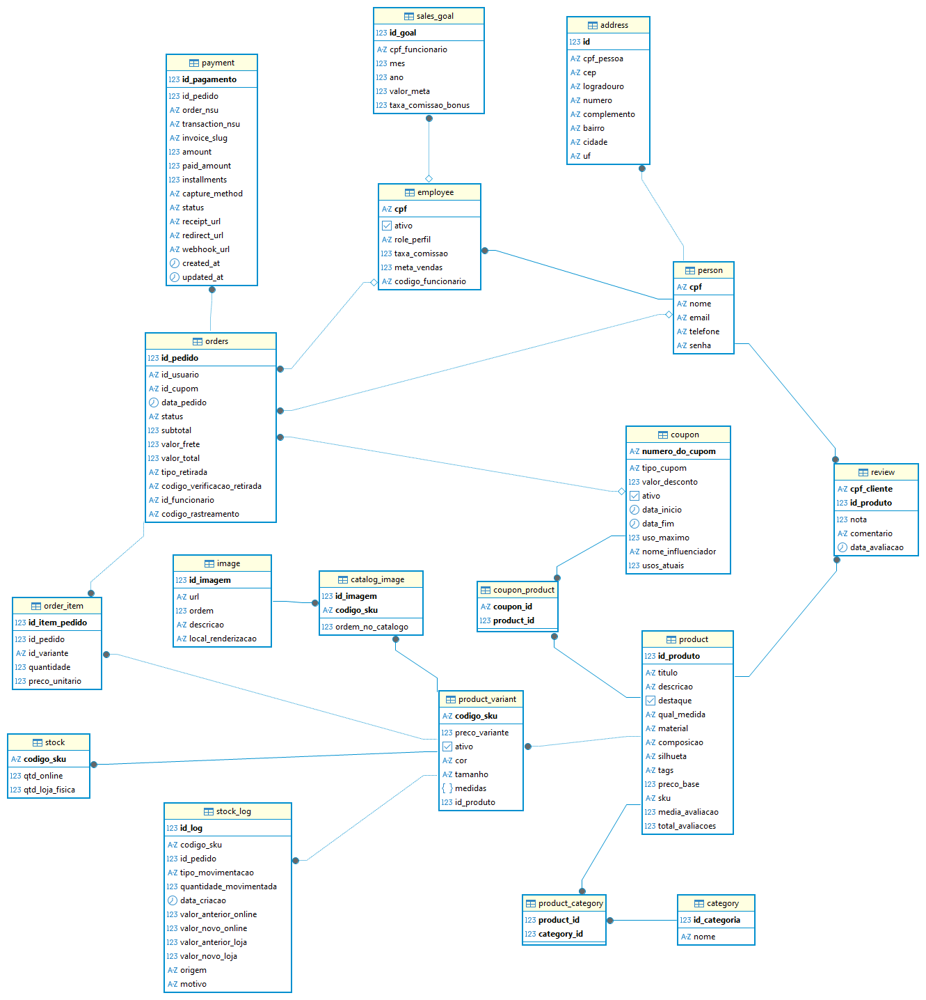

# Modelo Físico do Banco de Dados

## Visão Geral

O modelo físico apresentado representa a estrutura de banco de dados de um sistema de marketplace de moda, contemplando funcionalidades relacionadas a:

- Cadastro de pessoas e funcionários
- Produtos e variantes
- Controle de estoque
- Pedidos
- Pagamentos
- Cupons
- Avaliações
- Metas de vendas
- Imagens de catálogo
- Endereços
- Auditoria de movimentações

O banco foi modelado seguindo princípios relacionais, utilizando chaves primárias e estrangeiras para garantir integridade e relacionamento entre os dados.

---

# Estrutura Geral do Sistema

O banco está dividido em alguns grandes domínios:

| Domínio | Responsabilidade |
|---|---|
| Pessoas | Clientes e funcionários |
| Produtos | Produtos, categorias, variantes e imagens |
| Pedidos | Pedidos, itens e pagamentos |
| Estoque | Controle e histórico de movimentações |
| Marketing | Cupons e avaliações |
| Gestão | Metas de vendas |

---

# Entidades do Sistema

---

# Person

Tabela responsável pelo armazenamento das pessoas cadastradas na plataforma.

## Campos principais

| Campo | Descrição |
|---|---|
| cpf | Identificador único da pessoa |
| nome | Nome completo |
| email | Email da pessoa |
| telefone | Telefone de contato |
| senha | Senha de autenticação |

## Relacionamentos

- Uma pessoa pode possuir:
  - um endereço
  - avaliações
  - pedidos
  - um vínculo como funcionário

---

# Address

Tabela responsável pelo endereço associado a uma pessoa.

## Campos principais

| Campo | Descrição |
|---|---|
| id | Identificador do endereço |
| cpf_pessoa | Pessoa relacionada |
| cep | CEP |
| logradouro | Rua/Avenida |
| numero | Número do endereço |
| complemento | Complemento |
| bairro | Bairro |
| cidade | Cidade |
| uf | Unidade federativa |

## Relacionamentos

- Um endereço pertence a uma pessoa.

---

# Employee

Tabela que representa funcionários da loja.

A modelagem foi feita utilizando o CPF da pessoa como chave primária e chave estrangeira ao mesmo tempo, caracterizando uma especialização da entidade `person`.

## Campos principais

| Campo | Descrição |
|---|---|
| cpf | CPF do funcionário |
| ativo | Indica se o funcionário está ativo |
| role_perfil | Perfil de acesso |
| taxa_comissao | Comissão do funcionário |
| meta_vendas | Meta individual |
| codigo_funcionario | Código interno |

## Relacionamentos

- Um funcionário é obrigatoriamente uma pessoa.
- Um funcionário pode participar de pedidos.
- Um funcionário pode possuir metas de vendas.

---

# Sales Goal

Tabela responsável pelas metas de vendas dos funcionários.

## Campos principais

| Campo | Descrição |
|---|---|
| id_goal | Identificador |
| cpf_funcionario | Funcionário relacionado |
| mes | Mês da meta |
| ano | Ano da meta |
| valor_meta | Valor esperado |
| taxa_comissao_bonus | Comissão bônus |

## Relacionamentos

- Uma meta pertence a um funcionário.

---

# Product

Tabela principal de produtos.

## Campos principais

| Campo | Descrição |
|---|---|
| id_produto | Identificador do produto |
| titulo | Nome do produto |
| descricao | Descrição |
| destaque | Produto em destaque |
| qual_medida | Unidade de medida |
| material | Material |
| composicao | Composição |
| silhueta | Modelagem |
| tags | Tags de busca |
| preco_base | Preço base |
| sku | SKU principal |
| media_avaliacao | Média das avaliações |
| total_avaliacoes | Quantidade de avaliações |

## Relacionamentos

- Um produto pode:
  - possuir variantes
  - possuir categorias
  - possuir avaliações
  - participar de cupons

---

# Product Variant

Tabela responsável pelas variantes de produtos.

Permite que um mesmo produto possua diferentes:

- tamanhos
- cores
- medidas
- preços

## Campos principais

| Campo | Descrição |
|---|---|
| codigo_sku | SKU da variante |
| preco_variante | Preço específico |
| ativo | Disponibilidade |
| cor | Cor do produto |
| tamanho | Tamanho |
| medidas | Medidas adicionais |
| id_produto | Produto relacionado |

## Relacionamentos

- Uma variante pertence a um produto.
- Uma variante pode possuir:
  - estoque
  - imagens de catálogo
  - itens de pedido
  - movimentações de estoque

---

# Category

Tabela de categorias dos produtos.

## Campos principais

| Campo | Descrição |
|---|---|
| id_categoria | Identificador |
| nome | Nome da categoria |

---

# Product Category

Tabela associativa entre produtos e categorias.

Implementa relacionamento muitos-para-muitos.

## Relacionamentos

- Um produto pode possuir várias categorias.
- Uma categoria pode possuir vários produtos.

---

# Image

Tabela responsável pelas imagens do sistema.

## Campos principais

| Campo | Descrição |
|---|---|
| id_imagem | Identificador |
| url | URL da imagem |
| ordem | Ordem de exibição |
| descricao | Descrição |
| local_renderizacao | Local de exibição |

---

# Catalog Image

Tabela associativa entre imagens e variantes de produtos.

## Campos principais

| Campo | Descrição |
|---|---|
| id_imagem | Imagem relacionada |
| codigo_sku | Variante relacionada |
| ordem_no_catalogo | Ordem no catálogo |

---

# Stock

Tabela responsável pelo controle de estoque atual.

## Campos principais

| Campo | Descrição |
|---|---|
| codigo_sku | Variante relacionada |
| qtd_online | Quantidade disponível online |
| qtd_loja_fisica | Quantidade disponível em loja |

## Relacionamentos

- O estoque pertence a uma variante.

---

# Stock Log

Tabela de auditoria de movimentações de estoque.

Responsável por registrar:

- entradas
- saídas
- alterações
- ajustes

## Campos principais

| Campo | Descrição |
|---|---|
| id_log | Identificador |
| codigo_sku | Variante afetada |
| id_pedido | Pedido relacionado |
| tipo_movimentacao | Tipo da movimentação |
| quantidade_movimentada | Quantidade alterada |
| data_criacao | Data do evento |
| valor_anterior_online | Estoque anterior online |
| valor_novo_online | Estoque atualizado online |
| valor_anterior_loja | Estoque anterior físico |
| valor_novo_loja | Estoque atualizado físico |
| origem | Origem da alteração |
| motivo | Motivo da alteração |

---

# Orders

Tabela principal de pedidos.

## Campos principais

| Campo | Descrição |
|---|---|
| id_pedido | Identificador |
| id_usuario | Cliente responsável |
| id_cupom | Cupom aplicado |
| data_pedido | Data da compra |
| status | Status do pedido |
| subtotal | Valor parcial |
| valor_frete | Valor do frete |
| valor_total | Valor total |
| tipo_retirada | Forma de retirada |
| codigo_verificacao_retirada | Código de retirada |
| id_funcionario | Funcionário responsável |
| codigo_rastreamento | Rastreamento |

## Relacionamentos

- Um pedido:
  - pertence a um cliente
  - pode possuir cupom
  - pode possuir pagamento
  - possui itens
  - pode estar relacionado a um funcionário

---

# Order Item

Tabela de itens do pedido.

## Campos principais

| Campo | Descrição |
|---|---|
| id_item_pedido | Identificador |
| id_pedido | Pedido relacionado |
| id_variante | Variante comprada |
| quantidade | Quantidade adquirida |
| preco_unitario | Preço unitário |

## Relacionamentos

- Um item pertence a um pedido.
- Um item referencia uma variante de produto.

---

# Payment

Tabela responsável pelos pagamentos.

## Campos principais

| Campo | Descrição |
|---|---|
| id_pagamento | Identificador |
| id_pedido | Pedido relacionado |
| order_nsu | Código da ordem |
| transaction_nsu | Código da transação |
| invoice_slug | Identificador da cobrança |
| amount | Valor total |
| paid_amount | Valor pago |
| installments | Parcelas |
| capture_method | Método de captura |
| status | Status do pagamento |
| receipt_url | URL do comprovante |
| redirect_url | URL de redirecionamento |
| webhook_url | URL de webhook |
| created_at | Data de criação |
| updated_at | Data de atualização |

## Relacionamentos

- Um pagamento pertence a um pedido.

---

# Coupon

Tabela responsável pelos cupons promocionais.

## Campos principais

| Campo | Descrição |
|---|---|
| numero_do_cupom | Código do cupom |
| tipo_cupom | Tipo do desconto |
| valor_desconto | Valor aplicado |
| ativo | Situação do cupom |
| data_inicio | Início da validade |
| data_fim | Fim da validade |
| uso_maximo | Limite de uso |
| nome_influenciador | Influenciador relacionado |
| usos_atuais | Quantidade utilizada |

## Relacionamentos

- Um cupom pode:
  - ser aplicado em pedidos
  - possuir produtos específicos

---

# Coupon Product

Tabela associativa entre cupons e produtos.

Implementa relacionamento muitos-para-muitos.

---

# Review

Tabela responsável pelas avaliações dos produtos.

## Campos principais

| Campo | Descrição |
|---|---|
| cpf_cliente | Cliente avaliador |
| id_produto | Produto avaliado |
| nota | Nota atribuída |
| comentario | Comentário |
| data_avaliacao | Data da avaliação |

## Relacionamentos

- Uma avaliação pertence:
  - a uma pessoa
  - a um produto

---

# Considerações Arquiteturais

O modelo foi desenvolvido visando:

- Alta normalização
- Separação clara de responsabilidades
- Escalabilidade
- Facilidade de manutenção
- Integridade relacional

Além disso, foram utilizadas tabelas associativas para representar relacionamentos muitos-para-muitos, como:

- `product_category`
- `coupon_product`
- `catalog_image`

A modelagem também contempla mecanismos importantes para sistemas de marketplace, como:

- Controle de estoque
- Auditoria de movimentações
- Controle de permissões por funcionário
- Sistema de cupons
- Sistema de avaliações
- Integração com gateway de pagamento

## Histórico de Versionamento

| Versão | Autor                                        | Resumo                      | Data       |
| ------ | -------------------------------------------- | --------------------------- | ---------- |
| `1.6`  | [Leonardo Sauma](https://github.com/leohssjr) | Adição do modelo físico do banco de dados | 25/05/2026 |